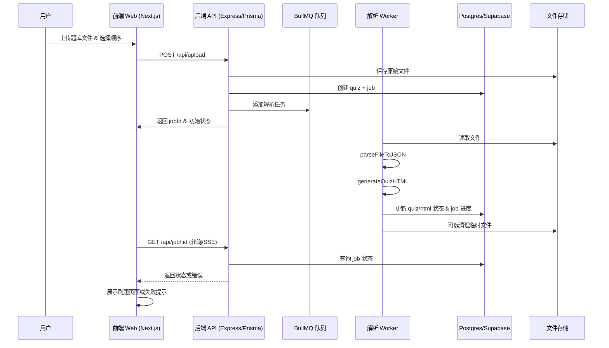

# Product Requirements Document (MVP)

## 核心目标 (Mission)
帮助驾考与各类突击考试的自学者，将杂乱题库迅速转换成可持续刷题的高质量网页体验，并记录解析与学习历程。

## 用户画像 (Persona)
- **自主备考学员**：希望快速导入真题/模拟题，在手机或电脑上一键刷题。
- **驾校/培训班快速突击学员**：备考时间有限，关注题目覆盖率与错题复盘。
- **核心痛点**：题库格式混乱、转换耗时，缺乏实时刷题界面与解析状态反馈。

## V1: 最小可行产品 (MVP)
1. 邮箱注册/登录与 JWT 会话（沿用 `apps/backend/src/routes/v2/auth.ts`）。
2. 题库上传（当前仅支持 .txt/.md 纯文本），顺序模式选择，文件校验与大小限制。
3. BullMQ 队列+Worker 解析：`parseFileToJSON` 结构化题库，`generateQuizHTML` 生成刷题页面。
4. 状态反馈：解析/生成过程实时进度，失败时提示原因并允许重新上传。
5. 题库管理列表：显示历史题库、状态、题量、生成时间；详情页可查看 HTML。
6. 单页刷题：嵌入生成的 HTML，提供重新生成 / 重新上传入口。
7. Supabase/Postgres 存储用户、题库、任务与解析日志（`users/quizzes/jobs`）。

## V2 及以后版本 (Future Releases)
- 错题本与学习统计、进度跟踪。
- 更多刷题模式（随机/章节/错题重练）。
- n8n 或其他自动化集成（通知、批量导入）。
- 多语言支持、OCR 图像解析、团队共享能力。
- 邮箱验证、密码重置、第三方登录等账户增强。

## 关键业务逻辑 (Business Rules)
1. 每次上传创建一条 `quiz` 记录（`pending → processing → completed/failed`），并关联 `job`。
2. Worker 解析失败即停止任务、更新 `quiz.status=failed` 并写入 `job.error`。
3. 上传文件类型受限，超出范围直接拒绝；解析生成的 HTML 不可手工编辑。
4. 历史题库保留，允许用户基于失败记录重新上传。
5. 仅登录用户可访问上传/刷题功能。

## 数据契约 (Data Contract)
- `users(id, email, password_hash, name, is_active, created_at)`
- `quizzes(id, user_id, title, description, order_mode, status, html, file_path, error_msg, created_at, updated_at)`
- `jobs(id, quiz_id, user_id, type, status, progress, data, result, error, created_at, updated_at)`
- `parse_logs`（可复用 `jobs.result/error`）记录 `raw_text_length`, `question_count`, `warnings`, `detected_format`。

## 选定原型：Prototype B – “上传区 + 历史列表” 双栏布局
```
┌────────────────────────────────────────────────────────┐
│ Header: Logo | 我的题库 | 上传题库 | 用户菜单               │
├───────────────┬────────────────────────────────────────┤
│ 上传面板       │ 题库列表                                  │
│ ┌───────────┐ │ ┌─卡片: 科目二模拟题───────────────┐      │
│ │ 上传区     │ │ │ 状态: completed  50题  2025/01  │      │
│ │ [选择文件] │ │ │ 按钮: [刷题] [详情]                │      │
│ │ [顺序/随机]│ │ └───────────────────────────────┘      │
│ │ [提交]     │ │ ┌─卡片: 科目一速成题────────────────┐  │
│ └───────────┘ │ │ 状态: failed   重新上传➡提示原因       │  │
│ 状态列表：      │ └───────────────────────────────┘      │
│  • 校验通过 ✓   │ …                                      │
│  • 排队中 ▣     │                                        │
│  • 生成HTML ✓   │                                        │
├───────────────┴────────────────────────────────────────┤
│ Footer: 客服帮助 | 使用条款 | 隐私                          │
└────────────────────────────────────────────────────────┘
```

### Prototype B 文案要点
- 上传面板标题：**“上传题库文件”**，提示“支持 TXT / DOCX / XLSX / PDF，最大 10MB”。
- 顺序开关文案：“出题顺序：顺序 / 随机（可后续切换）”。
- 提交按钮：“提交并开始解析”。
- 状态列表标题：“处理进度”，节点：“文件校验 ✓ / 队列处理中… / 生成 HTML ✓ / 失败重试”。
- 右侧题库列表：卡片显示“题库名称 · 题数 · 更新时间 · 状态标签（已完成/处理中/失败）”，操作按钮“刷题”“查看详情/错误”。
- 失败提示：“解析失败，请检查格式或重新上传。错误日志：…”。

## 架构设计蓝图

### 核心流程 (Mermaid)


### 组件交互说明
- **前端**：沿用现有 Next.js 界面，新增上传状态流与题库列表数据绑定。
- **后端**：
  - `routes/v2/upload.ts` 负责上传、文件校验、队列入队、状态接口。
  - `services/parser.ts` + `quizStructureParser.ts` 提供结构化解析。
  - `services/gemini.ts` 调用 AI（或 mock）生成 HTML。
  - `workers/quizWorker.ts` 串联解析 → AI → Prisma 更新。
- **数据库**：Prisma 指向 Supabase Postgres；统一移除旧 Mongo 依赖。
- **存储**：本地 `uploads/` 或 Supabase Storage（视部署环境安排）。

### 技术选型与风险
| 环节 | 技术 | 风险 | 缓解措施 |
|------|------|------|-----------|
| 后端框架 | Express + TypeScript | 现有代码混杂旧模块 | 清理 legacy 文件，统一 `app-v2.ts` 入口 |
| 数据层 | Prisma + Supabase | 需确保连接/迁移 | 写清 `.env`，提供初始化脚本 |
| 队列 | BullMQ + Redis | Redis 未启动则任务卡住 | 启动脚本检查 + 健康监控 |
| 文件解析 | mammoth/xlsx/pdf-parse | 格式复杂时失败率高 | 捕捉错误、提示用户重试 |
| AI 生成 | Gemini API/Mock | API Key 缺失→降级 Mock | `.env` 校验 + 日志提醒 |
| 前端上传 | Next.js | 文件过大/格式错误 | 上传前校验、友好错误提示 |
| 鉴权 | JWT + bcrypt | 缺少邮箱验证/重置 | MVP 暂未覆盖，Docs 标明 |

## 最终确认与存档
本文件为路线图、UI 方案及架构蓝图的最终确认版本。后续代码清理与实现按此执行。

### 解析手测记录
- `samples/quiz-sample.txt` → 成功，识别 2 题，格式判定 `standard`。
- `samples/quiz-sample.docx` / `quiz-sample.xlsx` → 暂不在 MVP 支持范围。
- `samples/quiz-sample.pdf` → 未支持，提示“请确认 PDF 未加密或扫描，可尝试导出为 Word/TXT 后重新上传”。
